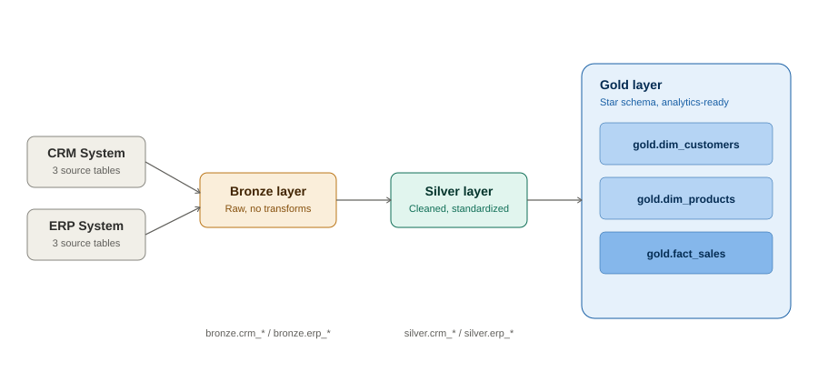
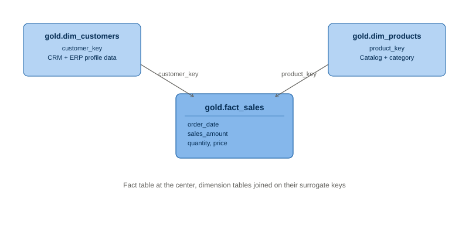

# SQL Data Warehouse Project

A complete end-to-end data warehousing and analytics solution built with PostgreSQL, demonstrating industry best practices in data engineering and analytical reporting.

---

## Project Overview

This project consolidates sales data from two source systems — a CRM and an ERP — into a unified data warehouse using a **medallion architecture** (Bronze → Silver → Gold). The result is a clean, analytics-ready star schema that supports business intelligence and reporting, backed by 12 SQL-based analysis scripts covering everything from data exploration to customer/product performance reporting.

---

## Architecture

```
Source Systems          Bronze Layer         Silver Layer         Gold Layer
                        (Raw Data)           (Cleaned Data)       (Analytics Ready)

CRM System    ───────►  bronze.crm_*  ────►  silver.crm_*  ────►  gold.dim_customers
ERP System    ───────►  bronze.erp_*  ────►  silver.erp_*  ────►  gold.dim_products
                                                                   gold.fact_sales

```

### Layer Descriptions

| Layer | Description |
|-------|-------------|
| **Bronze** | Raw data loaded directly from CSV source files with no transformations |
| **Silver** | Cleaned, standardized, and deduplicated data ready for integration |
| **Gold** | Business-ready star schema views combining silver tables for analytics |

---

## Star Schema

```
                    dim_customers
                         │
                         │ customer_key
                         │
dim_products ────── fact_sales
  product_key │
              │
              └── order_date, sales_amount, quantity, price


```

**Fact Table:** `gold.fact_sales` — transactional sales data

**Dimension Tables:**
- `gold.dim_customers` — customer profile combining CRM and ERP data
- `gold.dim_products` — product catalog with category information

---

## Data Sources

| Source | Tables | Description |
|--------|--------|-------------|
| CRM | crm_cust_info, crm_prd_info, crm_sales_details | Customer profiles, product info, sales transactions |
| ERP | erp_cust_az12, erp_loc_a101, erp_px_cat_g1v2 | Customer demographics, location data, product categories |

---

## Key Transformations (Silver Layer)

- **Deduplication** — ROW_NUMBER() to keep most recent customer record per ID
- **Name standardization** — TRIM to remove leading/trailing whitespace
- **Gender normalization** — mapped 'M'/'F' codes to 'Male'/'Female'
- **Marital status normalization** — mapped 'S'/'M' codes to 'Single'/'Married'
- **Date conversion** — integer date fields (YYYYMMDD) converted to proper DATE type
- **Invalid date handling** — zero values and incorrect formats set to NULL
- **Sales validation** — recalculated sales when original value was missing or inconsistent
- **Product key extraction** — SUBSTRING and REPLACE to derive category ID and clean product key
- **Product end dates** — LEAD() window function to calculate end date from next product's start date
- **Country standardization** — mapped country codes to full country names
- **Customer ID cleanup** — removed 'NAS' prefix from ERP customer IDs

---

## Data Analysis Layer

12 SQL scripts covering exploratory analysis through to full business reports, all querying the gold-layer star schema:

| Script | What it answers |
|--------|------------------|
| `Date_Range_Exploration.sql` | What's the temporal span of the data? |
| `Dimensions_Exploration.sql` | What distinct values exist across dimension tables (e.g. countries, categories)? |
| `Measures_Exploration.sql` | What are the core aggregate metrics (total sales, orders, quantity)? |
| `Magnitude_Analysis.sql` | How are totals distributed across categories (e.g. customers by country)? |
| `Ranking_Analysis.sql` | Which products/customers rank highest or lowest by revenue? |
| `Change_Over_Time_Analysis.sql` | How do key metrics trend month-over-month / year-over-year? |
| `Cumulative_Analysis.sql` | What do running totals and moving averages look like over time? |
| `Performance_Analysis.sql` | How does each product/region perform year-over-year against its own average? |
| `Part_To_Whole_Analysis.sql` | Which categories contribute most to overall sales? |
| `Data_Segmentation_Analysis.sql` | How do products/customers segment into meaningful groups (e.g. cost ranges)? |
| `Customer_Report.sql` | Consolidated customer report — segments (VIP/Regular/New), total orders, sales, and quantity per customer |
| `Product_Report.sql` | Consolidated product report — revenue segments (High/Mid/Low performers), orders, sales, and unique customers per product |

---

## Project Structure

```
sql-data-warehouse-project/
├── datasets/
│   ├── source_crm/           # Raw CRM CSVs (customer, product, sales)
│   └── source_erp/           # Raw ERP CSVs (customer demographics, location, category)
├── scripts/
│   ├── bronze_layer.sql      # Schema creation, table definitions, load procedure
│   ├── silver_layer.sql      # Table definitions and ETL stored procedure
│   └── gold_layer.sql        # Dimension and fact views (star schema)
├── Data_Analysis/            # 12 SQL scripts — exploration through business reporting
└── README.md
```

---

## How to Run

1. **Set up PostgreSQL** and create a new database called `Data_where_house`
2. **Run bronze_layer.sql** — creates schemas and bronze tables
3. **Update file paths** in the COPY commands to match your local dataset location
4. **Import CSV files** using pgAdmin Import/Export or the COPY command
5. **Run silver_layer.sql** — creates silver tables and executes transformations
6. **Run gold_layer.sql** — creates analytical views
7. **Run any script in `Data_Analysis/`** against the gold layer to reproduce the reports

```sql
-- Execute the load procedures
CALL bronze.load_bronze();
CALL silver.load_silver();

-- Query the gold layer
SELECT * FROM gold.fact_sales LIMIT 10;
SELECT * FROM gold.dim_customers LIMIT 10;
SELECT * FROM gold.dim_products LIMIT 10;
```

---

## Tech Stack

- **Database:** PostgreSQL 18
- **Tools:** pgAdmin 4
- **Concepts:** Medallion Architecture, Star Schema, ETL, Data Modelling, Stored Procedures, Window Functions, CTEs

---

## Key SQL Concepts Demonstrated

- Stored procedures with error handling
- Window functions (ROW_NUMBER, LEAD, LAG, RANK, DENSE_RANK, SUM/AVG OVER)
- Complex CASE statements for data standardization and segmentation
- Multi-table JOINs across source systems
- Data type conversions and NULL handling
- View creation for analytics layer
- Consolidated reporting views (customer and product 360° reports)

---

## Credits

The medallion architecture (Bronze/Silver/Gold) and overall project structure follow a well-known SQL data warehousing tutorial pattern. The implementation — schema design, transformation logic, stored procedures, and all 12 analysis scripts — was built independently in PostgreSQL using pgAdmin, as a hands-on way to learn the pattern rather than a direct copy.

---

## Author

**Rohit Mishra**  
M.Sc. AI and Data Science | Data Analyst  
[LinkedIn](https://linkedin.com/in/rohit-mishra-316883284) | [GitHub](https://github.com/rohitmishra76448)
